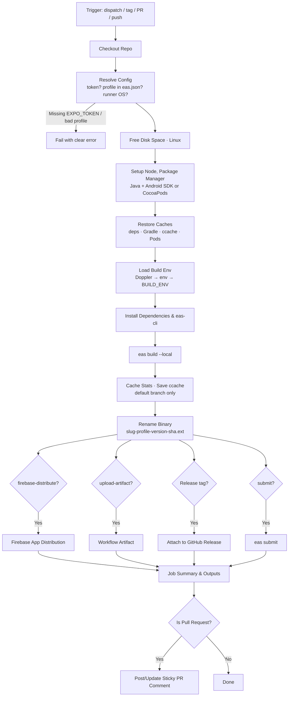

<p align="center">
  
</p>

<h1 align="center">expo-local-build</h1>

<p align="center">
  <strong>A reusable GitHub Actions workflow that builds your Expo app with <code>eas build --local</code> on GitHub's own runners. You get the same profiles, credentials and app versions as EAS cloud builds, without using your EAS build quota. Secrets can be loaded from Doppler, and builds can be uploaded as artifacts, attached to releases or submitted to the stores.</strong>
</p>

<p align="center">
  <a href="https://github.com/ym-actions/expo-local-build/blob/main/LICENSE"></a>
</p>

---

## ✨ Features

- 🏗️ **EAS Builds Without the Queue:** Runs `eas build --local` with your `eas.json` profiles. Signing credentials and remote app versions still come from EAS, but the build runs on a GitHub runner and doesn't use your EAS build quota.
- 🎛️ **Any Profile, Either Platform:** Build `development`, `preview`, `production` or any custom profile, for Android (Linux runner) or iOS (macOS runner, selected automatically).
- 🔐 **Doppler Built In:** Pass a `DOPPLER_TOKEN` and every secret in the config becomes a build-time env var, masked in the logs. This covers EAS variables with "Secret" visibility, which `eas build --local` [can't read](https://docs.expo.dev/build-reference/local-builds/).
- 🌍 **One Token per Environment:** Combine `environment` with GitHub environment secrets so each profile loads its own Doppler config, and production can require an approval.
- 📦 **Ready-to-Share Binaries:** Uploads the `.apk` / `.aab` / `.ipa` as a nicely named workflow artifact. It can also attach it to a GitHub Release, or hand it to `eas submit`.
- 🔥 **Firebase App Distribution:** Send builds straight to your testers. The Firebase app ID is found automatically from `google-services.json` / `GoogleService-Info.plist`, for the package each profile builds.
- 💬 **Sticky PR Comments:** On pull requests, the download link is posted on the PR and updated on every push. If a build fails, the comment says so.
- 📦 **Zero-Config Toolchain:** Detects npm, pnpm, yarn (classic & berry) or bun, reads `.nvmrc` / `.node-version`, and sets up Java and the Android SDK when needed.
- ⚙️ **Smart Caching:** Caches package manager downloads, Gradle dependencies, Gradle's build cache and CocoaPods between runs. Caches are saved from the default branch, where every branch and tag can read them.
- 🎯 **Build Only the ABIs You Need:** `android-architectures: arm64-v8a` covers almost every real phone and cuts native compile time roughly 4x for internal builds.
- 🧱 **ccache for Native Code:** Optional ccache support covers your app *and* library C++ (expo-modules-core, reanimated, …), so unchanged native code compiles in seconds.
- ⏱️ **Performance Report:** The job summary shows build time, cache sizes and ccache hit rate, so you can see what each setting buys you.
- 💽 **Room to Build:** On Linux, removes preinstalled toolchains the build doesn't need, so multi-ABI native builds don't run out of disk.
- 🗂️ **Monorepo Friendly:** Supports `working-directory`. Comments and concurrency groups are separated per app, platform and profile.
- 🚦 **Safe Concurrency:** A newer push cancels an in-progress PR build. Other builds are queued, never cancelled mid-flight.

---

## 📊 Workflow Overview



---

## ⚡ Quick Start

### 1. Add your Expo token as a repository secret

Create a token at **expo.dev → Account settings → Access tokens** (or a robot user's token for an organisation). Save it in your GitHub repository as `EXPO_TOKEN` under **Settings → Secrets and variables → Actions**.

Local builds still need it: EAS provides the signing credentials, and bumps the build number when `appVersionSource` is `remote`.

### 2. Call the workflow

Create `.github/workflows/build.yml`:

```yaml
name: Build

on:
  workflow_dispatch:
    inputs:
      profile:
        type: choice
        options: [development, preview, production]
        default: preview

jobs:
  build:
    uses: ym-actions/expo-local-build/.github/workflows/main.yml@1.x
    with:
      profile: ${{ inputs.profile }}
    secrets:
      EXPO_TOKEN: ${{ secrets.EXPO_TOKEN }}
```

Then go to **Actions → Build → Run workflow**, pick a profile, and download the binary from the run's artifacts when it finishes.

> [!IMPORTANT]
> `secrets: inherit` only works when the calling repository is in the **same organization or enterprise** as this workflow (`ym-actions`). From any other account or organization it silently passes nothing, and the run fails with *Missing EXPO_TOKEN*. Pass secrets explicitly, as above. The examples below use `secrets: inherit` for brevity, so swap it for an explicit list in your own repositories.

---

## 🔐 Build Environment & Doppler

Your app config and native build often need secrets: a Sentry auth token, API keys, and so on. Cloud EAS builds read them from EAS environment variables. **Local builds can't read EAS variables with "Secret" visibility**, so they have to come from the runner's environment instead. The workflow loads them from three places. When the same key appears more than once, the later source wins:

1. **Doppler**, when a `DOPPLER_TOKEN` secret is passed. A [service token](https://docs.doppler.com/docs/service-tokens) is scoped to a single config, so nothing else is needed. With a personal or service-account token, also set `doppler-project` and `doppler-config`.
2. The **`env` input**: non-secret `KEY=VALUE` lines.
3. The **`BUILD_ENV` secret**: secret `KEY=VALUE` lines.

Every value from Doppler and `BUILD_ENV` is masked in the logs, except for variables matching `public-env-pattern` (by default `^EXPO_PUBLIC_`). Those values ship inside the app anyway, and masking them would only make the logs harder to read.

### One Doppler config per profile

Use GitHub [environments](https://docs.github.com/en/actions/deployment/targeting-different-environments/using-environments-for-deployment) to give each profile its own token:

1. Create the environments `development`, `preview` and `production` under **Settings → Environments**.
2. In each one, add a `DOPPLER_TOKEN` secret containing a service token for the matching Doppler config (for example `dev`, `stg`, `prd`).
3. Optionally, add **required reviewers** to `production`, so release builds wait for approval.
4. Run the job in the environment that matches the profile:

```yaml
    with:
      profile: ${{ inputs.profile }}
      environment: ${{ inputs.profile }}
    secrets:
      EXPO_TOKEN: ${{ secrets.EXPO_TOKEN }}
      DOPPLER_TOKEN: ${{ secrets.DOPPLER_TOKEN }} # the environment's value wins
```

When the job runs in an environment, that environment's secrets take precedence over secrets passed by the caller.

---

## ⚙️ Configuration Reference

### Inputs

All inputs are optional. Boolean-like inputs take the strings `"true"` / `"false"`, matching the rest of the ym-actions ecosystem.

#### What to build

| Input               | Description                                                                                  | Default        |
| :------------------ | :------------------------------------------------------------------------------------------- | :------------- |
| `profile`           | Build profile from `eas.json`. The run fails early, listing the available profiles, if it doesn't exist. | `"production"` |
| `platform`          | `"android"` or `"ios"`. Call the workflow twice to build both.                               | `"android"`    |
| `working-directory` | Directory containing the Expo app and `eas.json`.                                            | `"."`          |
| `build-args`        | Extra arguments appended to `eas build`, e.g. `--clear-cache`.                               | `""`           |
| `environment`       | GitHub environment to run the job in. This enables environment secrets, required reviewers and wait timers. | `""` |

#### Build environment

| Input                | Description                                                                                   | Default           |
| :------------------- | :-------------------------------------------------------------------------------------------- | :---------------- |
| `env`                | Extra **non-secret** build-time environment variables, one `KEY=VALUE` per line.              | `""`              |
| `doppler-project`    | Doppler project. Not needed with a service token.                                             | `""`              |
| `doppler-config`     | Doppler config. Not needed with a service token.                                              | `""`              |
| `public-env-pattern` | Regex of variable names whose values are **not** masked in logs. Set to `""` to mask everything. | `"^EXPO_PUBLIC_"` |

#### Toolchain

| Input             | Description                                                                                                         | Default    |
| :---------------- | :------------------------------------------------------------------------------------------------------------------ | :--------- |
| `node-version`    | Node version, e.g. `"22"`. `"auto"` reads `.nvmrc` / `.node-version` and falls back to `lts/*`.                     | `"auto"`   |
| `package-manager` | `"auto"`, `"npm"`, `"pnpm"`, `"yarn"` or `"bun"`. Auto-detection checks the `packageManager` field first, then the lockfile. | `"auto"` |
| `install-command` | Custom install command. `"auto"` uses the detected package manager. `"none"` skips it (not recommended, because `eas-cli` needs your dependencies to read the app config). | `"auto"` |
| `java-version`    | JDK version for Android builds.                                                                                     | `"17"`     |
| `eas-cli-version` | Version of [`eas-cli`](https://www.npmjs.com/package/eas-cli) to install globally. Ignored when a local CLI is used. | `"latest"` |
| `use-local-cli`   | Use `eas-cli` from your project's dependencies instead of installing it globally. Falls back to a global install, with a warning, if it isn't found. | `"false"` |

#### Performance

See [Making Builds Faster](#-making-builds-faster) for how these fit together.

| Input                   | Description                                                                                                         | Default    |
| :---------------------- | :------------------------------------------------------------------------------------------------------------------ | :--------- |
| `android-architectures` | Android ABIs to compile, comma-separated: `armeabi-v7a`, `arm64-v8a`, `x86`, `x86_64`. Empty builds the project's default (usually all four). | `""` |
| `cache`                 | Cache package manager downloads, Gradle (dependencies, wrapper and build cache) and CocoaPods.                      | `"true"`   |
| `cache-read-only`       | Restore the Gradle and ccache caches without saving them. `"auto"` saves only on the default branch.                | `"auto"`   |
| `ccache`                | Compile C/C++ through [ccache](https://ccache.dev) and keep its cache between runs.                                 | `"false"`  |
| `ccache-max-size`       | Maximum size of the ccache cache.                                                                                   | `"2G"`     |
| `gradle-jvmargs`        | JVM args for Gradle. `"auto"` sizes the Gradle and Kotlin daemon heaps to the runner's RAM, with 1 GB of metaspace each. A custom value, e.g. `"-Xmx6g -XX:MaxMetaspaceSize=1g"`, sets `org.gradle.jvmargs`. `"project"` keeps your project's own settings. | `"auto"` |
| `free-disk-space`       | On Linux, delete preinstalled toolchains the build doesn't use (.NET, Haskell, CodeQL, Swift, Docker images).       | `"true"`   |

#### What to do with the build

| Input             | Description                                                                                                  | Default  |
| :---------------- | :----------------------------------------------------------------------------------------------------------- | :------- |
| `upload-artifact` | Upload the binary as a workflow artifact.                                                                    | `"true"` |
| `artifact-name`   | Artifact and file name, without extension. `"auto"` gives `<slug>-<profile>-<version>-<sha>`, e.g. `moonlit-preview-1.0.0-a1b2c3d`. | `"auto"` |
| `retention-days`  | Days to keep the artifact (number). `0` uses the repository default.                                         | `14`     |
| `github-release`  | Attach the binary to a GitHub Release. `"auto"` does so only when the run was triggered by a tag. The release is created if it doesn't exist. Needs `contents: write`. | `"false"` |
| `release-tag`     | Release tag to attach to.                                                                                    | triggering tag |
| `submit`          | Run `eas submit` with the built binary. The submission itself runs on EAS servers.                           | `"false"` |
| `submit-profile`  | Submit profile from `eas.json`.                                                                              | `profile` |

#### Firebase App Distribution

See [Firebase App Distribution](#-firebase-app-distribution) for setup.

| Input                    | Description                                                                                       | Default    |
| :----------------------- | :------------------------------------------------------------------------------------------------ | :--------- |
| `firebase-distribute`    | Upload the binary to Firebase App Distribution.                                                   | `"false"`  |
| `firebase-app-id`        | Firebase app ID, e.g. `1:1234:android:abcd`. `"auto"` looks it up by the package this profile builds. | `"auto"` |
| `firebase-groups`        | Tester group aliases to notify, comma-separated.                                                  | `""`       |
| `firebase-testers`       | Tester emails to notify, comma-separated.                                                         | `""`       |
| `firebase-release-notes` | Notes shown to testers. `"auto"` uses the PR title or commit message, followed by profile, version, build number and commit. | `"auto"` |
| `firebase-tools-version` | Version of [`firebase-tools`](https://www.npmjs.com/package/firebase-tools) used to upload.      | `"latest"` |

#### Reporting

| Input           | Description                                                                                 | Default                  |
| :-------------- | :------------------------------------------------------------------------------------------ | :----------------------- |
| `comment-on-pr` | Post and update a sticky PR comment with the download link, or with failure details. Needs `pull-requests: write`. | `"true"` |
| `build-name`    | Label used in the job name, comments and summary.                                           | `"<Platform> <profile>"` |

#### Runner & checkout

| Input             | Description                                                                         | Default        |
| :---------------- | :---------------------------------------------------------------------------------- | :------------- |
| `runs-on`         | Runner label. `"auto"` uses `ubuntu-latest` for Android and `macos-latest` for iOS. | `"auto"`       |
| `timeout-minutes` | Job timeout in minutes (number).                                                    | `90`           |
| `ref`             | Git ref to check out.                                                               | triggering ref |
| `submodules`      | `"false"`, `"true"` or `"recursive"`.                                               | `"false"`      |

### Secrets

| Secret          | Required | Description                                                                                              |
| :-------------- | :------- | :------------------------------------------------------------------------------------------------------- |
| `EXPO_TOKEN`    | Yes\*    | Expo access token.                                                                                       |
| `DOPPLER_TOKEN` | No       | Doppler token. Its config's secrets are loaded as build-time env vars (see [Build Environment](#-build-environment--doppler)). |
| `BUILD_ENV`     | No       | **Secret** build-time env vars, one `KEY=VALUE` per line. Every value is masked in the logs.             |
| `FIREBASE_SERVICE_ACCOUNT` | With `firebase-distribute` | JSON key of a service account with the **Firebase App Distribution Admin** role. It can also be a `FIREBASE_SERVICE_ACCOUNT` variable in Doppler or `BUILD_ENV`. |

\* It is declared optional so that you can provide it through a GitHub `environment` instead. If it is missing at runtime, the job fails early with a clear error.

### Permissions

The workflow doesn't declare permissions. It inherits whatever the calling job grants, so you only grant what you use:

| Feature                  | Permission              |
| :----------------------- | :---------------------- |
| Building & artifacts     | `contents: read`        |
| `comment-on-pr`          | `pull-requests: write`  |
| `github-release`         | `contents: write`       |

A failure to post the PR comment never fails the build.

### Outputs

| Output          | Description                                                        |
| :-------------- | :----------------------------------------------------------------- |
| `artifact-path` | Path of the binary on the runner, relative to the workspace.       |
| `artifact-name` | Name of the uploaded workflow artifact.                            |
| `artifact-url`  | Download URL of the workflow artifact.                             |
| `build-type`    | `apk`, `aab`, `ipa`, or `tar.gz` for iOS simulator builds.         |
| `app-version`   | App version from the Expo config.                                  |
| `release-url`   | URL of the GitHub Release the binary was attached to.              |
| `build-seconds` | Duration of the `eas build` step, in seconds.                      |
| `version-code`  | Android `versionCode` / iOS build number of the binary (`apk` and `ipa` only). |
| `firebase-console-url` | Firebase console link to the App Distribution release.      |
| `firebase-testing-url` | Link testers can open to install the release.               |

---

## 🔥 Firebase App Distribution

```yaml
    with:
      profile: preview
      firebase-distribute: "true"
      firebase-groups: qa
    secrets:
      EXPO_TOKEN: ${{ secrets.EXPO_TOKEN }}
      FIREBASE_SERVICE_ACCOUNT: ${{ secrets.FIREBASE_SERVICE_ACCOUNT }}
```

After the build, the binary is uploaded with `firebase appdistribution:distribute`, and the testers in `firebase-groups` / `firebase-testers` get an email. The console and tester links appear in the job summary, the outputs and the PR comment.

### One-time setup

1. **Register each package as an app in Firebase.** Firebase treats every package name or bundle ID as a separate app. If your profiles build different packages (e.g. `com.acme.app` and `com.acme.app.preview`), add each one under **Project settings → Your apps → Add app**, then commit the updated `google-services.json` / `GoogleService-Info.plist`.
2. **Turn on App Distribution.** In the Firebase console, open **App Distribution** and click **Get started**. Under **Testers & Groups**, create a group (e.g. `qa`). Its *alias* is what goes in `firebase-groups`.
3. **Create a service account.** In [Google Cloud console](https://console.cloud.google.com/iam-admin/serviceaccounts), select the Firebase project and click **Create service account**. Give it the **Firebase App Distribution Admin** role, then under **Keys → Add key → JSON** download a key. Save the whole JSON file as the `FIREBASE_SERVICE_ACCOUNT` secret. (The old `firebase login:ci` tokens are deprecated and not supported.)

### How the app ID is found

With `firebase-app-id: "auto"`, the workflow reads your app config the way the build profile sees it, including the profile's `env` in `eas.json` and anything it `extends`. This matters because an `APP_VARIANT`-style variable often changes the package name. It then looks that package up in `google-services.json` (Android), or checks `GoogleService-Info.plist`'s `BUNDLE_ID` (iOS). This happens **before** the build, so an unregistered package fails in seconds, listing the packages it did find. Set `firebase-app-id` to skip the lookup.

### APK, AAB and IPA

- **APK** (e.g. profiles with `"distribution": "internal"`): works out of the box.
- **AAB** (store builds): Firebase can only distribute app bundles when the Firebase project is **linked to Google Play** (**Project settings → Integrations → Google Play**) and the app exists in Play Console. For store builds, Play's internal testing track (`submit: "true"`) is usually the better fit.
- **IPA**: ad hoc builds only install on devices registered in the provisioning profile. Register testers' devices with `eas device:create` and rebuild. iOS simulator builds can't be distributed.

### Build numbers

Firebase accepts the same version again. Re-uploading an identical binary just updates the existing release, and a new binary with the same number becomes a new release. Either way, testers keep seeing the same "1.0.0 (1)", which is confusing. With `"appVersionSource": "remote"` in `eas.json`, add `"autoIncrement": true` to the profiles you distribute. EAS then bumps the build number on every build, including local ones. The user-facing version (`1.0.0`) still comes from your app config.

---

## 🚀 Making Builds Faster

Most of an Android build's time goes into compiling C++ (React Native libraries and your app's codegen), once per ABI, then Kotlin. In order of payoff:

### 1. Build fewer ABIs for internal builds

Phones are almost all `arm64-v8a`. `x86` and `x86_64` only run on emulators, and `armeabi-v7a` only on old 32-bit devices. For development and preview builds you hand to testers, one ABI is enough:

```yaml
    with:
      profile: ${{ inputs.profile }}
      # all four for the store, arm64 only for everything else
      android-architectures: ${{ inputs.profile != 'production' && 'arm64-v8a' || '' }}
```

> [!WARNING]
> Write the expression as `!= 'production' && 'arm64-v8a' || ''`. The reverse (`== 'production' && '' || 'arm64-v8a'`) always gives `arm64-v8a`, because `''` is falsy in GitHub expressions.

This sets the `reactNativeArchitectures` Gradle property for the app and every library module, through `ORG_GRADLE_PROJECT_reactNativeArchitectures`.

### 2. Let the caches warm up on the default branch

GitHub [scopes caches by ref](https://docs.github.com/en/actions/writing-workflows/choosing-what-your-workflow-does/caching-dependencies-to-speed-up-workflows#restrictions-for-accessing-a-cache). A run can read caches saved on its own branch or tag, and caches saved on the default branch. Caches saved on a tag or feature branch can't be used by anything else. So by default (`cache-read-only: "auto"`), the Gradle and ccache caches are **only saved from the default branch**. Every other run restores them.

In practice, run a build from `main` now and then, for example with **Run workflow** on `main`, and your tag and PR builds start warm. Gradle caching uses [`gradle/actions/setup-gradle`](https://github.com/gradle/actions/tree/main/setup-gradle). It caches by content, prunes unused entries, and saves even when the build fails. The workflow also enables Gradle's build cache (`org.gradle.caching=true`, in the user-level `gradle.properties`, as EAS cloud does), so unchanged Kotlin and Java modules are restored instead of recompiled.

### 3. Turn on ccache

```yaml
    with:
      ccache: "true"
```

On Android, React Native only routes your app's own CMake project through ccache. The workflow also sets `CMAKE_C_COMPILER_LAUNCHER` / `CMAKE_CXX_COMPILER_LAUNCHER`, so library C++ is cached too. On iOS it sets `USE_CCACHE=1`, which React Native's pod setup honours. The cache lives where EAS cloud keeps it (`~/.cache/ccache` on Linux, `~/Library/Caches/ccache` on macOS), and the job summary reports the hit rate.

The first run fills the cache and is slightly *slower*. Later runs with unchanged native code should show a high hit rate. If the summary shows **0 compilations**, the build didn't honour the launcher. Turn it off, and open an issue.

> [!NOTE]
> On iOS, if your Podfile passes `ccache_enabled:` to `react_native_post_install` explicitly, that value wins over `USE_CCACHE`. Enable it there, for example through `expo-build-properties` (`ios.ccacheEnabled`).

### 4. Gradle memory is sized for you

The Expo / React Native template sets `-Xmx2048m -XX:MaxMetaspaceSize=512m`. That's sized for a laptop, and on larger apps the Gradle or Kotlin daemon runs out of metaspace. The build then **hangs** instead of failing, with lines like `java.lang.OutOfMemoryError: Metaspace` repeating in the log. With the default `gradle-jvmargs: "auto"`, the workflow gives the Gradle daemon 40% of the runner's RAM (at most 8 GB) and the Kotlin daemon 25% (at most 4 GB), with 1 GB of metaspace each. The rest is left for the native compilers. Set a custom value to tune it, or `"project"` to use your own `gradle.properties`.

### Reading the performance report

Each run's summary includes the `eas build` duration, the whole job's duration, the ABIs built, Gradle cache sizes, the ccache hit rate, and whether caches were saved. Compare a few runs before and after changing a setting.

---

## 🔧 Examples

### On-demand builds plus tag releases

Manual runs build any profile. Pushing `v1.2.3` builds production, and pushing `preview-1.2.3` builds a preview attached to a GitHub Release:

```yaml
name: Build

on:
  workflow_dispatch:
    inputs:
      profile:
        type: choice
        options: [development, preview, production]
        default: preview
      platform:
        type: choice
        options: [android, ios]
        default: android
  push:
    tags: ["v*", "preview-*"]

jobs:
  build:
    uses: ym-actions/expo-local-build/.github/workflows/main.yml@1.x
    permissions:
      contents: write # attach binaries to releases
    with:
      profile: ${{ inputs.profile || (startsWith(github.ref_name, 'preview-') && 'preview' || 'production') }}
      platform: ${{ inputs.platform || 'android' }}
      environment: ${{ inputs.profile || (startsWith(github.ref_name, 'preview-') && 'preview' || 'production') }}
      github-release: auto
    secrets: inherit
```

### Both platforms

```yaml
jobs:
  android:
    uses: ym-actions/expo-local-build/.github/workflows/main.yml@1.x
    with:
      profile: production
      platform: android
    secrets: inherit

  ios:
    uses: ym-actions/expo-local-build/.github/workflows/main.yml@1.x
    with:
      profile: production
      platform: ios # runs on macos-latest automatically
    secrets: inherit
```

### Build and submit to Google Play

```yaml
    with:
      profile: production
      submit: "true"
    secrets: inherit
```

`eas submit` uses the submit profile in `eas.json`, and the store credentials stored on EAS (for Android, a Google service account key).

### Doppler with a personal token

```yaml
    with:
      doppler-project: my-app
      doppler-config: prd
    secrets:
      EXPO_TOKEN: ${{ secrets.EXPO_TOKEN }}
      DOPPLER_TOKEN: ${{ secrets.DOPPLER_TOKEN }}
```

### Monorepo

```yaml
    with:
      working-directory: apps/mobile
      build-name: Mobile
```

---

## 💡 Tips & Troubleshooting

### How long does a build take, and what does it cost?

An Android release build that compiles native code for all four ABIs usually takes **20–35 minutes** on a standard runner the first time. Building one ABI, warm caches and ccache bring that down a lot. See [Making Builds Faster](#-making-builds-faster). Standard runners are free for public repositories. For private repositories, the build uses your plan's included Actions minutes, and beyond that a per-minute rate. macOS runners (needed for iOS) bill at roughly ten times the Linux rate. Check [GitHub's billing docs](https://docs.github.com/en/billing/managing-billing-for-your-products/managing-billing-for-github-actions/about-billing-for-github-actions) for current figures.

### Ship JS changes without rebuilding

A native build is only needed when native code or config changes. Those are new libraries with native code, config plugins, and `app.json` permissions or entitlements. JS-only changes can go out with `eas update`, which doesn't need a build at all.

### "Missing EXPO_TOKEN" although the secret exists

You're most likely calling the workflow with `secrets: inherit` from a repository outside the `ym-actions` organization. [GitHub only passes inherited secrets within one organization or enterprise](https://docs.github.com/en/actions/how-tos/reuse-automations/reuse-workflows). Pass each secret explicitly:

```yaml
    secrets:
      EXPO_TOKEN: ${{ secrets.EXPO_TOKEN }}
      DOPPLER_TOKEN: ${{ secrets.DOPPLER_TOKEN }}
```

Environment secrets are the exception. When the job runs in an `environment`, that environment's secrets are used directly, whatever the caller passes. The secret still has to be declared by this workflow (`EXPO_TOKEN`, `DOPPLER_TOKEN` or `BUILD_ENV`).

### "Missing EXPO_TOKEN" on pull requests from forks

GitHub doesn't pass secrets to workflows triggered by pull requests from forks. To skip those builds instead of failing, add a condition to the calling job:

```yaml
jobs:
  build:
    if: github.event.pull_request.head.repo.full_name == github.repository || github.event_name != 'pull_request'
```

### The build hangs with `OutOfMemoryError: Metaspace`

Cancel it, because it won't recover. Make sure `gradle-jvmargs` is `"auto"` (the default) or a value with enough metaspace, e.g. `"-Xmx4g -XX:MaxMetaspaceSize=1g"`.

### Firebase distribution fails

The step prints a specific hint for common failures:

- **Permission denied / 403**: the service account needs the *Firebase App Distribution Admin* role, in the project that owns the app.
- **Not found / 404**: App Distribution isn't enabled yet (**Get started** in the console), or the service account belongs to a different project.
- **App bundle rejected**: link the Firebase project to Google Play, or distribute an APK profile instead.

### "No space left on device"

Keep `free-disk-space: "true"` (the default), and consider building fewer ABIs with `android-architectures`.

### A variable works in EAS cloud builds but is empty here

It's probably an EAS environment variable with **Secret** visibility, which local builds can't read. Put it in Doppler or `BUILD_ENV` instead.

### Versioning

Reference the workflow by its major version branch (`@1.x`) to receive non-breaking updates automatically, or pin a tag or commit SHA for full reproducibility.

---

## 📄 License

This action is open-sourced under the [MIT License](LICENSE).
