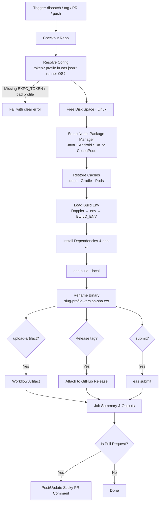

<p align="center">
  
</p>

<h1 align="center">expo-local-build</h1>

<p align="center">
  <strong>A reusable GitHub Actions workflow that builds your Expo app with <code>eas build --local</code> on GitHub's own runners. You get the same profiles, credentials and app versions as EAS cloud builds, without using your EAS build quota. Secrets can be loaded from Doppler, and builds can be uploaded as artifacts, attached to releases or submitted to the stores.</strong>
</p>

<p align="center">
  <a href="https://github.com/ym-actions/expo-local-build/blob/main/LICENSE"></a>
</p>

---

## ✨ Features

- 🏗️ **EAS Builds Without the Queue:** Runs `eas build --local` with your `eas.json` profiles. Signing credentials and remote app versions still come from EAS, but the build runs on a GitHub runner and doesn't use your EAS build quota.
- 🎛️ **Any Profile, Either Platform:** Build `development`, `preview`, `production` or any custom profile, for Android (Linux runner) or iOS (macOS runner, selected automatically).
- 🔐 **Doppler Built In:** Pass a `DOPPLER_TOKEN` and every secret in the config becomes a build-time env var, masked in the logs. This covers EAS variables with "Secret" visibility, which `eas build --local` [can't read](https://docs.expo.dev/build-reference/local-builds/).
- 🌍 **One Token per Environment:** Combine `environment` with GitHub environment secrets so each profile loads its own Doppler config, and production can require an approval.
- 📦 **Ready-to-Share Binaries:** Uploads the `.apk` / `.aab` / `.ipa` as a nicely named workflow artifact. It can also attach it to a GitHub Release, or hand it to `eas submit`.
- 💬 **Sticky PR Comments:** On pull requests, the download link is posted on the PR and updated on every push. If a build fails, the comment says so.
- 📦 **Zero-Config Toolchain:** Detects npm, pnpm, yarn (classic & berry) or bun, reads `.nvmrc` / `.node-version`, and sets up Java and the Android SDK when needed.
- ⚙️ **Smart Caching:** Caches package manager downloads, Gradle and CocoaPods between runs.
- 💽 **Room to Build:** On Linux, removes preinstalled toolchains the build doesn't need, so multi-ABI native builds don't run out of disk.
- 🗂️ **Monorepo Friendly:** Supports `working-directory`. Comments and concurrency groups are separated per app, platform and profile.
- 🚦 **Safe Concurrency:** A newer push cancels an in-progress PR build. Other builds are queued, never cancelled mid-flight.

---

## 📊 Workflow Overview



---

## ⚡ Quick Start

### 1. Add your Expo token as a repository secret

Create a token at **expo.dev → Account settings → Access tokens** (or a robot user's token for an organisation). Save it in your GitHub repository as `EXPO_TOKEN` under **Settings → Secrets and variables → Actions**.

Local builds still need it: EAS provides the signing credentials, and bumps the build number when `appVersionSource` is `remote`.

### 2. Call the workflow

Create `.github/workflows/build.yml`:

```yaml
name: Build

on:
  workflow_dispatch:
    inputs:
      profile:
        type: choice
        options: [development, preview, production]
        default: preview

jobs:
  build:
    uses: ym-actions/expo-local-build/.github/workflows/main.yml@1.x
    with:
      profile: ${{ inputs.profile }}
    secrets:
      EXPO_TOKEN: ${{ secrets.EXPO_TOKEN }}
```

Then go to **Actions → Build → Run workflow**, pick a profile, and download the binary from the run's artifacts when it finishes.

> [!TIP]
> Instead of listing secrets you can use `secrets: inherit`.

---

## 🔐 Build Environment & Doppler

Your app config and native build often need secrets: a Sentry auth token, API keys, and so on. Cloud EAS builds read them from EAS environment variables. **Local builds can't read EAS variables with "Secret" visibility**, so they have to come from the runner's environment instead. The workflow loads them from three places. When the same key appears more than once, the later source wins:

1. **Doppler**, when a `DOPPLER_TOKEN` secret is passed. A [service token](https://docs.doppler.com/docs/service-tokens) is scoped to a single config, so nothing else is needed. With a personal or service-account token, also set `doppler-project` and `doppler-config`.
2. The **`env` input**: non-secret `KEY=VALUE` lines.
3. The **`BUILD_ENV` secret**: secret `KEY=VALUE` lines.

Every value from Doppler and `BUILD_ENV` is masked in the logs, except for variables matching `public-env-pattern` (by default `^EXPO_PUBLIC_`). Those values ship inside the app anyway, and masking them would only make the logs harder to read.

### One Doppler config per profile

Use GitHub [environments](https://docs.github.com/en/actions/deployment/targeting-different-environments/using-environments-for-deployment) to give each profile its own token:

1. Create the environments `development`, `preview` and `production` under **Settings → Environments**.
2. In each one, add a `DOPPLER_TOKEN` secret containing a service token for the matching Doppler config (for example `dev`, `stg`, `prd`).
3. Optionally, add **required reviewers** to `production`, so release builds wait for approval.
4. Run the job in the environment that matches the profile:

```yaml
    with:
      profile: ${{ inputs.profile }}
      environment: ${{ inputs.profile }}
    secrets: inherit
```

When the job runs in an environment, that environment's secrets take precedence over secrets passed by the caller.

---

## ⚙️ Configuration Reference

### Inputs

All inputs are optional. Boolean-like inputs take the strings `"true"` / `"false"`, matching the rest of the ym-actions ecosystem.

#### What to build

| Input               | Description                                                                                  | Default        |
| :------------------ | :------------------------------------------------------------------------------------------- | :------------- |
| `profile`           | Build profile from `eas.json`. The run fails early, listing the available profiles, if it doesn't exist. | `"production"` |
| `platform`          | `"android"` or `"ios"`. Call the workflow twice to build both.                               | `"android"`    |
| `working-directory` | Directory containing the Expo app and `eas.json`.                                            | `"."`          |
| `build-args`        | Extra arguments appended to `eas build`, e.g. `--clear-cache`.                               | `""`           |
| `environment`       | GitHub environment to run the job in. This enables environment secrets, required reviewers and wait timers. | `""` |

#### Build environment

| Input                | Description                                                                                   | Default           |
| :------------------- | :-------------------------------------------------------------------------------------------- | :---------------- |
| `env`                | Extra **non-secret** build-time environment variables, one `KEY=VALUE` per line.              | `""`              |
| `doppler-project`    | Doppler project. Not needed with a service token.                                             | `""`              |
| `doppler-config`     | Doppler config. Not needed with a service token.                                              | `""`              |
| `public-env-pattern` | Regex of variable names whose values are **not** masked in logs. Set to `""` to mask everything. | `"^EXPO_PUBLIC_"` |

#### Toolchain

| Input             | Description                                                                                                         | Default    |
| :---------------- | :------------------------------------------------------------------------------------------------------------------ | :--------- |
| `node-version`    | Node version, e.g. `"22"`. `"auto"` reads `.nvmrc` / `.node-version` and falls back to `lts/*`.                     | `"auto"`   |
| `package-manager` | `"auto"`, `"npm"`, `"pnpm"`, `"yarn"` or `"bun"`. Auto-detection checks the `packageManager` field first, then the lockfile. | `"auto"` |
| `install-command` | Custom install command. `"auto"` uses the detected package manager. `"none"` skips it (not recommended, because `eas-cli` needs your dependencies to read the app config). | `"auto"` |
| `java-version`    | JDK version for Android builds.                                                                                     | `"17"`     |
| `eas-cli-version` | Version of [`eas-cli`](https://www.npmjs.com/package/eas-cli) to install globally. Ignored when a local CLI is used. | `"latest"` |
| `use-local-cli`   | Use `eas-cli` from your project's dependencies instead of installing it globally. Falls back to a global install, with a warning, if it isn't found. | `"false"` |
| `cache`           | Cache package manager downloads, Gradle (Android) and CocoaPods (iOS).                                              | `"true"`   |
| `free-disk-space` | On Linux, delete preinstalled toolchains the build doesn't use (.NET, Haskell, CodeQL, Swift, Docker images).       | `"true"`   |

#### What to do with the build

| Input             | Description                                                                                                  | Default  |
| :---------------- | :----------------------------------------------------------------------------------------------------------- | :------- |
| `upload-artifact` | Upload the binary as a workflow artifact.                                                                    | `"true"` |
| `artifact-name`   | Artifact and file name, without extension. `"auto"` gives `<slug>-<profile>-<version>-<sha>`, e.g. `moonlit-preview-1.0.0-a1b2c3d`. | `"auto"` |
| `retention-days`  | Days to keep the artifact (number). `0` uses the repository default.                                         | `14`     |
| `github-release`  | Attach the binary to a GitHub Release. `"auto"` does so only when the run was triggered by a tag. The release is created if it doesn't exist. Needs `contents: write`. | `"false"` |
| `release-tag`     | Release tag to attach to.                                                                                    | triggering tag |
| `submit`          | Run `eas submit` with the built binary. The submission itself runs on EAS servers.                           | `"false"` |
| `submit-profile`  | Submit profile from `eas.json`.                                                                              | `profile` |

#### Reporting

| Input           | Description                                                                                 | Default                  |
| :-------------- | :------------------------------------------------------------------------------------------ | :----------------------- |
| `comment-on-pr` | Post and update a sticky PR comment with the download link, or with failure details. Needs `pull-requests: write`. | `"true"` |
| `build-name`    | Label used in the job name, comments and summary.                                           | `"<Platform> <profile>"` |

#### Runner & checkout

| Input             | Description                                                                         | Default        |
| :---------------- | :---------------------------------------------------------------------------------- | :------------- |
| `runs-on`         | Runner label. `"auto"` uses `ubuntu-latest` for Android and `macos-latest` for iOS. | `"auto"`       |
| `timeout-minutes` | Job timeout in minutes (number).                                                    | `90`           |
| `ref`             | Git ref to check out.                                                               | triggering ref |
| `submodules`      | `"false"`, `"true"` or `"recursive"`.                                               | `"false"`      |

### Secrets

| Secret          | Required | Description                                                                                              |
| :-------------- | :------- | :------------------------------------------------------------------------------------------------------- |
| `EXPO_TOKEN`    | Yes\*    | Expo access token.                                                                                       |
| `DOPPLER_TOKEN` | No       | Doppler token. Its config's secrets are loaded as build-time env vars (see [Build Environment](#-build-environment--doppler)). |
| `BUILD_ENV`     | No       | **Secret** build-time env vars, one `KEY=VALUE` per line. Every value is masked in the logs.             |

\* It is declared optional so that you can provide it through a GitHub `environment` instead. If it is missing at runtime, the job fails early with a clear error.

### Permissions

The workflow doesn't declare permissions. It inherits whatever the calling job grants, so you only grant what you use:

| Feature                  | Permission              |
| :----------------------- | :---------------------- |
| Building & artifacts     | `contents: read`        |
| `comment-on-pr`          | `pull-requests: write`  |
| `github-release`         | `contents: write`       |

A failure to post the PR comment never fails the build.

### Outputs

| Output          | Description                                                        |
| :-------------- | :----------------------------------------------------------------- |
| `artifact-path` | Path of the binary on the runner, relative to the workspace.       |
| `artifact-name` | Name of the uploaded workflow artifact.                            |
| `artifact-url`  | Download URL of the workflow artifact.                             |
| `build-type`    | `apk`, `aab`, `ipa`, or `tar.gz` for iOS simulator builds.         |
| `app-version`   | App version from the Expo config.                                  |
| `release-url`   | URL of the GitHub Release the binary was attached to.              |

---

## 🔧 Examples

### On-demand builds plus tag releases

Manual runs build any profile. Pushing `v1.2.3` builds production, and pushing `preview-1.2.3` builds a preview attached to a GitHub Release:

```yaml
name: Build

on:
  workflow_dispatch:
    inputs:
      profile:
        type: choice
        options: [development, preview, production]
        default: preview
      platform:
        type: choice
        options: [android, ios]
        default: android
  push:
    tags: ["v*", "preview-*"]

jobs:
  build:
    uses: ym-actions/expo-local-build/.github/workflows/main.yml@1.x
    permissions:
      contents: write # attach binaries to releases
    with:
      profile: ${{ inputs.profile || (startsWith(github.ref_name, 'preview-') && 'preview' || 'production') }}
      platform: ${{ inputs.platform || 'android' }}
      environment: ${{ inputs.profile || (startsWith(github.ref_name, 'preview-') && 'preview' || 'production') }}
      github-release: auto
    secrets: inherit
```

### Both platforms

```yaml
jobs:
  android:
    uses: ym-actions/expo-local-build/.github/workflows/main.yml@1.x
    with:
      profile: production
      platform: android
    secrets: inherit

  ios:
    uses: ym-actions/expo-local-build/.github/workflows/main.yml@1.x
    with:
      profile: production
      platform: ios # runs on macos-latest automatically
    secrets: inherit
```

### Build and submit to Google Play

```yaml
    with:
      profile: production
      submit: "true"
    secrets: inherit
```

`eas submit` uses the submit profile in `eas.json`, and the store credentials stored on EAS (for Android, a Google service account key).

### Doppler with a personal token

```yaml
    with:
      doppler-project: my-app
      doppler-config: prd
    secrets:
      EXPO_TOKEN: ${{ secrets.EXPO_TOKEN }}
      DOPPLER_TOKEN: ${{ secrets.DOPPLER_TOKEN }}
```

### Monorepo

```yaml
    with:
      working-directory: apps/mobile
      build-name: Mobile
```

---

## 💡 Tips & Troubleshooting

### How long does a build take, and what does it cost?

An Android release build that compiles native code for all four ABIs usually takes **20–35 minutes** on a standard runner the first time. Gradle caching shortens later runs. Standard runners are free for public repositories. For private repositories, the build uses your plan's included Actions minutes, and beyond that a per-minute rate. macOS runners (needed for iOS) bill at roughly ten times the Linux rate. Check [GitHub's billing docs](https://docs.github.com/en/billing/managing-billing-for-your-products/managing-billing-for-github-actions/about-billing-for-github-actions) for current figures.

To speed up internal builds, restrict the ABIs in the build profile:

```json
"preview": {
  "env": { "ORG_GRADLE_PROJECT_reactNativeArchitectures": "arm64-v8a" }
}
```

### Ship JS changes without rebuilding

A native build is only needed when native code or config changes. Those are new libraries with native code, config plugins, and `app.json` permissions or entitlements. JS-only changes can go out with `eas update`, which doesn't need a build at all.

### "Missing EXPO_TOKEN" on pull requests from forks

GitHub doesn't pass secrets to workflows triggered by pull requests from forks. To skip those builds instead of failing, add a condition to the calling job:

```yaml
jobs:
  build:
    if: github.event.pull_request.head.repo.full_name == github.repository || github.event_name != 'pull_request'
```

### "No space left on device"

Keep `free-disk-space: "true"` (the default), and consider limiting ABIs as shown above.

### A variable works in EAS cloud builds but is empty here

It's probably an EAS environment variable with **Secret** visibility, which local builds can't read. Put it in Doppler or `BUILD_ENV` instead.

### Versioning

Reference the workflow by its major version branch (`@1.x`) to receive non-breaking updates automatically, or pin a tag or commit SHA for full reproducibility.

---

## 📄 License

This action is open-sourced under the [MIT License](LICENSE).
